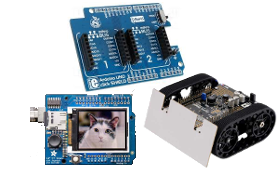

# FEZ Introduction
---

FEZ (fast and easy) is the official board for TinyCLR OS. This low-cost, WiFi IoT-ready, Arduino-pinout compatible, and TinyCLR-OS-ready board is everything a developer needs to evaluate TinyCLR OS and to build modern IoT applications.

|  |  |
|--|--|
| **TinyCLR**   [Learn more...](tinyclr.md) | **Arduino**   [Learn more...](arduino.md) |
|  |  |
| **Mbed**   [Learn more...](mbed.md) | **MicroPython**   [Learn more...](python.md) |
|  |  |
| **Plain Coding!**   [Learn more...](plain_coding.md) | **Accessories**   [Learn more...](accessories.md)
|  | 
