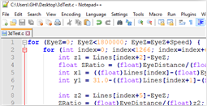

# Plain Coding!
---

You can just start coding everything from scratch. The easiest options would be to start with [**Mbed**](https://www.mbed.com) online tools and then export the project. Wither way, you can use free open-source GNU GCC tools to build your programs, which is what we use to build TinyCLR OS firmware. Another option is to use a commercial compiler, like Keil compiler/IDE. Keil tools are free for 32KB or less program size (MDK-Lite).

> [!Tip]
> If you are not adding a SWD-JTAG tool, like ST-Link, follow the [STM32 bootloader](../hardware/loaders/stm32_bootloader.md) instructions on generating and loading DFU files. 
 
* [Keil Website](http://www.keil.com/)
* [Keil ARM MDK tools](http://www2.keil.com/mdk5)
* [GNU ARM Tools (GCC)](https://developer.arm.com/open-source/gnu-toolchain/gnu-rm/downloads)