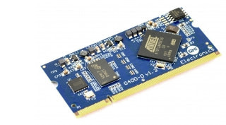
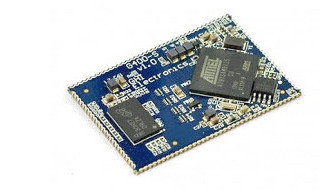
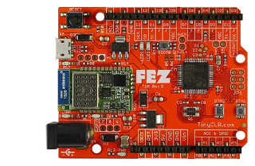
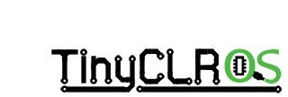
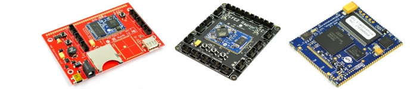

# GHI Electronics Documentation
---
Here you will find technical documentation for our products. Please visit our main website **for non-technical details**: **http://www.ghielectronics.com.** You can visit our **community forums here:** **https://forums.ghielectronics.com/**

> [!Note]
> Please check back often for the latest updates to our products, documentation, and software.

***

## Product Sections
|  |  |
|---|---|
| **UCM (Universal Compute Modules)**   Our Universal Compute Modules are based on a 200 pin SO-DIMM form factor.  They adhere to a standard pin out to make it easy to change modules to fit the needs of your product. [Learn More...](ucm/intro.md) | **SCM (Surface Compute Modules)**   Our Surface Compute Modules are surface mount versions of our UCM modules.  They are ideal for products destined for harsh or high vibration environments. [Learn More...](scm/intro.md) |
|             |      |
| **FEZ**   The FEZ (fast and easy) is our maker-targeted board with arduino compatible pinout and optional WiFi. [Learn More...](fez/intro.md) | **TinyCLR Operating System**   TinyCLR OS is light weight .NET operating system for IoT and embedded devices. [Learn More...](tinyclr/intro.md) |
|         |  |

***
| |
|---------------------|
| **Legacy Products**   Here you will find information on our legacy products and our longevity policy. [Learn More...](legacy/intro.md) |
|  |

***

Visit our main website http://www.ghielectronics.com and the comunity forums https://forums.ghielectronics.com/