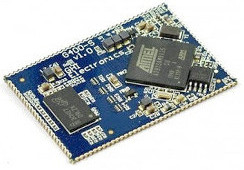
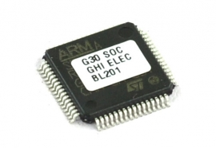
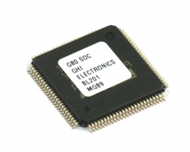
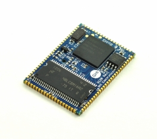
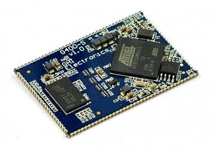

# Surface Mount Compute Modules
---

Our Surface Compute Modules are surface mount embedded controllers which can be programmed using .NET and Visual Studio. They are ideal for products destined for harsh or high vibration environments.

|  |  |
|--|--|
| **G30**   [Learn more...](g30.md) | **G80**   [Learn more...](g80.md) |
|  |  |
| **G120 / G120E**   [Learn more...](g120.md) | **G400S**   [Learn more...](g400s.md) |
|  |  |
 