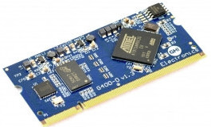
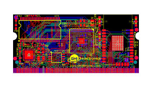
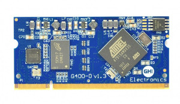
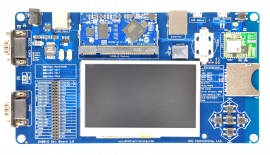

# Universal Compute Modules
---

Our Universal Compute Modules are based on a 200 pin SO-DIMM form factor.  They adhere to a standard pin out to make it easy to change modules to fit the needs of your product.

|  |  |
|--|--|
| **The UCM Standard**   Makes upgrading a snap! [Learn more...](standard.md) | **UC2550**   Our low power UCM. [Learn more...](uc2550.md) |
|  |  |
| **UC5500**   Available in two versions. [Learn more...](uc5550.md) | **G400D**   Our original UCM. [Learn more...](g400d.md) |
|  |  |
| **Development Options**   Development boards, breakout boards, displays. [Learn more...](accessories.md) |  |
|  |  |
